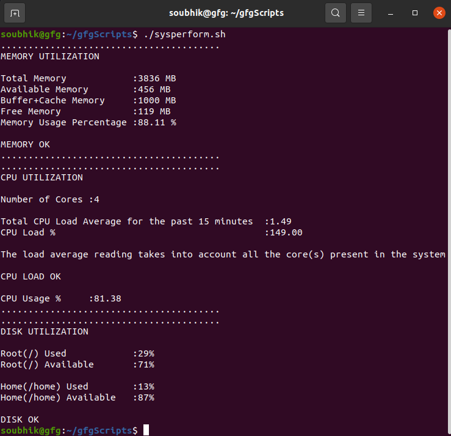

# 🧠 Assignment: Shell Script to Monitor Server Performance

  

## Objective

Write a shell script that displays real-time server performance metrics including:

- Memory utilization
- CPU usage
- Disk performance
  
This script will help you practice basic shell scripting, system monitoring commands, and output formatting.

---
## Tasks
### 📝 Task 1: Memory Utilization

1. Use appropriate command(s) in your shell script to create a function that shows the following information:
- total memory
- available memory
- Buffer & chache
- free memory
- memory usage percentage
- if available or (free+buffer+cache) is below 100 MiB, then warn the user by outputting `Available Memory or the free and buffer+cache Memory is too low!` otherwise print `Memory is ok!`
2. Format the output so it's easily readable.

### ⚙️ Task 2: CPU Utilization

1. Use appropriate command(s) in your shell script to create a function that shows the following information:
- Number of Cores
- Total CPU Load Average for the past 15 minutes
- CPU Load
- The load average: This reading takes into account all the core(s) present in the system,  
if load average is equal to the number of cores, print warning `Load average not ideal.`,  
if load average is bigger than the the number of cores then print warning `Critical! Load average is too high!`  
if load average is less than the number of cores print `CPU load is ok`

### 💽 Task 3: Disk Performance and Usage

1. Use appropriate command(s) in your shell script to create a function that shows the following information:
- Root (/) file system usage percentage and the free percentage
- Home (/home) file system usage percentage and the free percentage
- print warning if any of the disk is used above 95% -> `Disk is almost full! Free up some space!`
else! `Disk is ok`
---

## 🧪 Test Criteria

- Script must be executable and the output is something like this:

